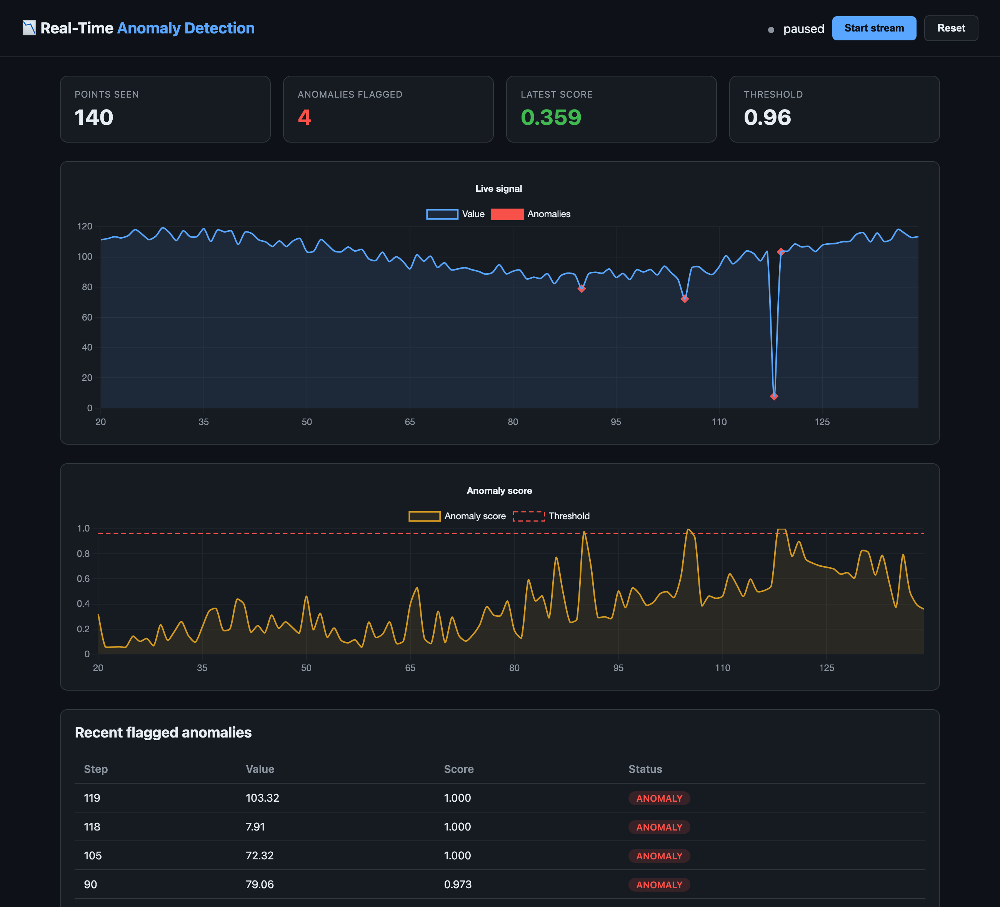

# 📉 Real-Time Anomaly Detection API

[](https://github.com/areeba-khizer/anomaly-detection/actions/workflows/ci.yml)


A production-style service that scores streaming time-series data points for
anomalies in real time using an **Isolation Forest**, served behind a
**FastAPI** endpoint, with a built-in **live dashboard** that visualises the
signal and flags anomalies as they happen.

Built to mirror the kind of monitoring used for payment transactions, IoT
sensor telemetry, and logistics metrics.



> The dashboard streams simulated telemetry, scores every point with the
> Isolation Forest, and marks flagged anomalies (red) on the live signal — note
> the dropout near step 113 driving the anomaly score above the threshold.

---

## Features

- **Streaming simulator** — generates a realistic univariate signal (trend +
  daily seasonality + noise) and injects spikes, dropouts and level shifts.
- **Isolation Forest detector** — online scoring with rolling-window context
  features (local mean/std, deviation, first difference) and an
  auto-calibrated decision threshold.
- **FastAPI service** — `POST` a data point, get back an anomaly score in
  `[0, 1]` and a boolean flag.
- **Live dashboard** — Chart.js view of the signal, the anomaly score vs.
  threshold, and a table of recently flagged anomalies.
- **Tested & reproducible** — `pytest` suite covering the detector, simulator
  and API; deterministic simulation via seeds.

---

## Architecture

```
          ┌──────────────────┐      features      ┌────────────────────┐
 stream → │ TimeSeriesSim    │ ─────────────────→ │ AnomalyDetector    │
 / POST   │ (or your data)   │   value + context  │ (Isolation Forest) │
          └──────────────────┘                    └─────────┬──────────┘
                                                            │ score [0,1]
                                              ┌─────────────▼─────────────┐
                                              │ FastAPI  /score /stream    │
                                              │          /history /health  │
                                              └─────────────┬─────────────┘
                                                            │ JSON
                                                  ┌─────────▼─────────┐
                                                  │ Chart.js dashboard│
                                                  └───────────────────┘
```

| Path | Purpose |
|------|---------|
| [app/simulator.py](app/simulator.py) | Synthetic streaming time-series generator |
| [app/detector.py](app/detector.py) | Isolation Forest online detector |
| [app/main.py](app/main.py) | FastAPI app, endpoints and dashboard route |
| [app/static/dashboard.html](app/static/dashboard.html) | Live dashboard |
| [train.py](train.py) | Fit + persist the model, print eval metrics |
| [scripts/stream_demo.py](scripts/stream_demo.py) | Feed a simulated stream into the API |
| [app/dataset.py](app/dataset.py) | Loader + labels for the real NAB NYC taxi dataset |
| [scripts/replay_dataset.py](scripts/replay_dataset.py) | Replay real data and evaluate vs known anomalies |
| [tests/test_api.py](tests/test_api.py) | Test suite |
| [Dockerfile](Dockerfile) · [docker-compose.yml](docker-compose.yml) | Containerised deployment |
| [render.yaml](render.yaml) | One-click deploy to Render |
| [.github/workflows/ci.yml](.github/workflows/ci.yml) | CI: tests + Docker build |

---

## Quickstart

```bash
# 1. Create a virtual environment and install dependencies
python -m venv .venv
source .venv/bin/activate          # Windows: .venv\Scripts\activate
pip install -r requirements.txt

# 2. (Optional) Train and persist the model with eval metrics
python train.py

# 3. Run the API + dashboard
uvicorn app.main:app --reload

# 4. Open the dashboard
#    http://127.0.0.1:8000        -> live dashboard
#    http://127.0.0.1:8000/docs   -> interactive API docs
```

If no `model.joblib` is present, the API fits a model on baseline data at
startup, so it always boots ready to score.

### Run with Docker

The image trains the model at build time, so the container boots ready to
score and ships with a healthcheck.

```bash
docker compose up --build      # then open http://127.0.0.1:8000

# or with plain Docker
docker build -t anomaly-detection .
docker run -p 8000:8000 anomaly-detection
```

### Deploy to Render

This repo includes a [render.yaml](render.yaml) blueprint, so it deploys to
[Render](https://render.com) with no extra configuration:

1. Push the repo to GitHub (already done).
2. On Render: **New → Blueprint**, then connect this repository.
3. Render reads `render.yaml`, builds the Docker image, and deploys the
   service with a healthcheck on `/health`. The free tier is sufficient.

Once live, the dashboard is at your service URL (e.g.
`https://anomaly-detection.onrender.com`) and the API docs at `/docs`.

---

## API

### `POST /score`
Score a single data point.

```bash
curl -X POST http://127.0.0.1:8000/score \
  -H 'Content-Type: application/json' \
  -d '{"value": 137.5}'
```

```json
{
  "step": 0,
  "timestamp": 1780568768.44,
  "value": 137.5,
  "anomaly_score": 0.91,
  "is_anomaly": false,
  "threshold": 0.96
}
```

| Endpoint | Method | Description |
|----------|--------|-------------|
| `/score` | POST | Score a submitted data point |
| `/stream/next` | GET | Generate + score the next simulated point |
| `/history` | GET | Recent scored points (powers the dashboard) |
| `/health` | GET | Service / model status |
| `/reset` | POST | Clear history and restart the demo stream |
| `/` | GET | Live dashboard |
| `/docs` | GET | OpenAPI / Swagger UI |

### Feed a simulated stream

```bash
python scripts/stream_demo.py --n 200 --delay 0.2
```

---

## How it works

The detector keeps a **rolling window** of recent values and, for each new
point, derives context features: the raw value, the local mean and standard
deviation, the deviation from the local mean, and the first difference. An
`IsolationForest` is fit once on a baseline of normal data; its raw decision
score is normalised to `[0, 1]` (higher = more anomalous), and the decision
**threshold is auto-calibrated** from a high quantile of the baseline score
distribution so only genuinely unusual points are flagged.

On a held-out stream with 5% injected anomalies the default configuration
achieves roughly **precision 0.67 / recall 0.82** — tune `contamination`,
`window` and `calibration_quantile` in [app/detector.py](app/detector.py) for
your own trade-off.

---

## Validation on real data (NAB)

The simulator is convenient for the live demo, but the detector is also
validated against **real, human-labelled anomalies** from the
[Numenta Anomaly Benchmark](https://github.com/numenta/NAB). The bundled
[`data/nyc_taxi.csv`](data/nyc_taxi.csv) is NYC taxi demand in 30-minute
buckets (Jul 2014 – Jan 2015, 10,320 points) with five known anomalies caused
by real events.

```bash
python scripts/replay_dataset.py            # score in-process
python scripts/replay_dataset.py --api http://127.0.0.1:8000   # via the API
```

Replaying the series through the detector:

```
Known anomalies (NAB ground truth):
  [DETECTED] NYC Marathon         2014-10-30 – 2014-11-03
  [  MISSED] Thanksgiving         2014-11-25 – 2014-11-29
  [DETECTED] Christmas            2014-12-23 – 2014-12-27
  [DETECTED] New Year's           2014-12-29 – 2015-01-03
  [DETECTED] Jan 2015 snowstorm   2015-01-24 – 2015-01-29

Detected 4/5 known anomalies.
Total points flagged: 87 (0.8% of stream); 4 outside known windows.
```

It catches **4 of the 5** known events with a 0.8% overall flag rate. The
missed one (Thanksgiving) has a milder dip than the sharp Christmas/New
Year/snowstorm drops — a fair illustration of where an unsupervised,
univariate Isolation Forest trades recall for a very low false-positive rate.

---

## Production considerations

Notes on what it would take to run this for real — the trade-offs a streaming
detector has to make:

- **Concept drift.** A model fit on last month's baseline goes stale as traffic
  patterns shift (seasonal sales, new sensors). In production I'd schedule
  periodic retraining on a rolling window of recent *normal* data and track the
  flagged-anomaly rate as a drift signal.
- **State & scaling.** The detector currently keeps its rolling window in
  process memory, so horizontal scaling needs either sticky routing per stream
  or an external store (e.g. Redis) for the window — otherwise replicas score
  with inconsistent context.
- **Latency.** Scoring is a single Isolation Forest pass over a 5-feature
  vector — sub-millisecond — so throughput is bound by the web layer, not the
  model. The `/score` path does no blocking I/O.
- **Threshold tuning.** The decision threshold is auto-calibrated from the
  baseline score distribution; the right operating point depends on the cost of
  false positives vs. missed anomalies, which is a business decision, not a
  purely technical one.
- **Cold start & persistence.** The model is trained at build time and loaded
  on startup, so there's no first-request penalty; `model.joblib` is a
  versioned artifact you could promote through environments.
- **Observability.** Next steps would be structured request logging, a
  `/metrics` endpoint (Prometheus) for score distribution and flag rate, and
  alerting when the anomaly rate spikes.

## Testing

```bash
pytest -q
```

Continuous integration runs the test suite on Python 3.11 and 3.12 and builds
and smoke-tests the Docker image on every push — see
[.github/workflows/ci.yml](.github/workflows/ci.yml).

---

## Tech stack

`Python` · `FastAPI` · `scikit-learn` · `Isolation Forest` · `NumPy` ·
`Chart.js` · `Uvicorn` · `Docker` · `GitHub Actions` · `pytest` · `NAB`

---

## Data

- **Live demo:** synthetic stream from [app/simulator.py](app/simulator.py).
- **Validation:** real NYC taxi demand from the
  [Numenta Anomaly Benchmark](https://github.com/numenta/NAB)
  (`data/nyc_taxi.csv`), © Numenta Inc., included under NAB's MIT license for
  benchmarking.
